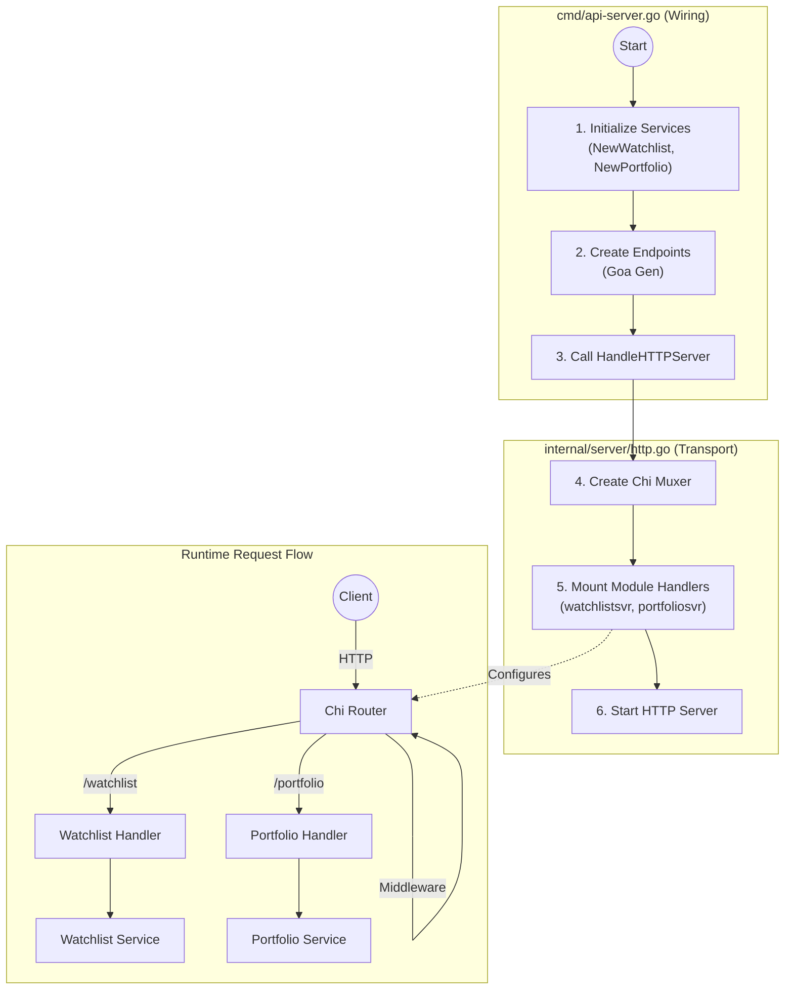

# API Server Architecture

This document explains the architecture of the `ta-server` application, specifically focusing on how it handles modularity and dependency injection using the Chi router and Goa framework.

## Overview

The server follows a layered architecture that separates **Dependency Injection (Wiring)** from **HTTP Transport Logic**.

- **Entry Point**: [`cmd/api-server.go`](../apps/ta-server/cmd/api-server.go)
- **HTTP/Router**: [`internal/server/http.go`](../apps/ta-server/internal/server/http.go)
- **Modules**: Located in `modules/*/go`

## Architecture Visualization



## 1. Wiring & Dependency Injection (`cmd/api-server.go`)

The entry point file `cmd/api-server.go` is responsible for initializing the application state and wiring dependencies. It does **not** handle HTTP routing directly.

### Responsibilities:
1.  **Initialize Services**: Imports and instantiates pure logic modules (services).
    ```go
    portfolioSvc = portfolio.NewPortfolio(stdLogger)
    watchlistSvc = watchlist.NewWatchlist(stdLogger)
    ```
2.  **Wrap in Endpoints**: Wraps service instances in Goa-generated `Endpoints`. This layer adapts the pure service interface to a transport-agnostic endpoint definition.
    ```go
    portfolioEndpoints = portfolioGen.NewEndpoints(portfolioSvc)
    ```
3.  **Delegate to Server**: Calls `server.HandleHTTPServer` to start the transport layer, passing only the prepared endpoints.

## 2. Router & Modularization (`internal/server/http.go`)

The `internal/server/http.go` file handles the HTTP transport layer. It uses the **Chi router** (underlying Goa's muxer) to achieve modularization.

### Mechanism:
1.  **Shared Router**: A single, shared Chi-based `Muxer` is created.
    ```go
    mux = goahttp.NewMuxer() // Wraps Chi
    ```
2.  **Mounting Modules**: Each module's generated server handler is "mounted" onto this common router. This allows each module (`watchlist`, `portfolio`) to define its own routes (e.g., `/watchlist/{id}`, `/portfolio/summary`) independently while sharing the same server instance.
    ```go
    // Mount Watchlist routes
    watchlistsvr.Mount(mux, watchlistServer)
    
    // Mount Portfolio routes
    portfoliosvr.Mount(mux, portfolioServer)
    ```
3.  **Middleware**: Standard execution middleware (Request ID, Logger, Recoverer) is applied globally to the router to ensure consistent behavior across all modules.

## Summary

| Component | Responsibility |
| :--- | :--- |
| `cmd/api-server.go` | **Configuration & Wiring.** "Plugins" the modules into the application. |
| `internal/server/http.go` | **Transport & Routing.** Provides the "socket" (Router) where modules attach. |
| `modules/*/go` | **Business Logic.** Pure Go implementation, unaware of HTTP/Chi. |

## Middleware Strategy

When deciding where to store middleware, follow these guidelines based on the scope and purpose of the middleware:

### 1. Global / Infrastructure Middleware → `apps/ta-server/`
Middleware that affects the entire application or relates to infrastructure should live in the app's transport layer (`internal/server/middleware` or applied in `http.go`).
- **Examples**: CORS, Request Logging, Recovery (panic handling), Request ID, Opentelemetry tracing.
- **Rationale**: These are application-level configuration details part of the **Composition Root**.

### 2. Domain / Business Middleware → `modules/`
Middleware that enforces logic specific to a domain should be defined within that module.
- **Examples**: `ValidateTickerExists`, `CheckWatchlistOwnership`, `FormatInsightOutput`.
- **Rationale**: Keeps business rules co-located with the logic they protect. This supports the **Common Closure Principle** (what changes together should live together).

### 3. Shared Middleware Utilities → `modules/core/go/middleware` (Future)
Reusable middleware components that are not domain-specific but are common across multiple applications within the monorepo.
- **Examples**: Custom Auth adapters, Standardized error formatters, Rate limiting logic.
- **Rationale**: Promotes **Reusability** while keeping the applications decoupled from specific implementations.

### Implementation Tip
In the Chi/Goa setup, you apply global middleware in `internal/server/http.go` using `handler = chimiddleware.X(handler)`. Domain-specific middleware should be wrapped around the generated `Endpoints` in `cmd/api-server.go` using `endpoints.Use(middleware)`.

## Configuration

The server supports configuration via CLI flags, environment variables, and a configuration file. Configuration precedence is: **Flags > Environment Variables > Config File > Defaults**.

### CLI Flags (`api-server` command)

| Flag | Default | Description |
| :--- | :--- | :--- |
| `--host` | `localhost` | Server host to bind to. |
| `--port` | `8080` | HTTP port to listen on. |
| `--log-level` | `INFO` | Log level (`DEBUG`, `INFO`, `WARN`, `ERROR`). |
| `--log-format` | `json` | Log format (`json`, `text`). |
| `--secure` | `false` | Use HTTPS scheme. |
| `--debug` | `false` | Enable debug logging (DEPRECATED: use `--log-level=DEBUG`). |

Global flags:
- `--config`: Path to config file (default is `ta-server.yaml` in current working directory or `$HOME/.ta-server`).

### Environment Variables

Environment variables are prefixed with `TA_SERVER_`. Variables mapping to `api-server` flags include the `API_SERVER_` namespace.

| Variable | Corresponds to Flag | Example |
| :--- | :--- | :--- |
| `TA_SERVER_API_SERVER_HOST` | `--host` | `0.0.0.0` |
| `TA_SERVER_API_SERVER_PORT` | `--port` | `8000` |
| `TA_SERVER_API_SERVER_LOG_LEVEL` | `--log-level` | `DEBUG` |
| `TA_SERVER_API_SERVER_LOG_FORMAT` | `--log-format` | `text` |
| `TA_SERVER_API_SERVER_SECURE` | `--secure` | `true` |

### Configuration File (`ta-server.yaml`)

The server looks for a `ta-server.yaml` file in the current directory or `$HOME/.ta-server/`.

**Example `ta-server.yaml`:**
```yaml
api-server:
  host: "0.0.0.0"
  port: 8080
  log-level: "INFO"
```
