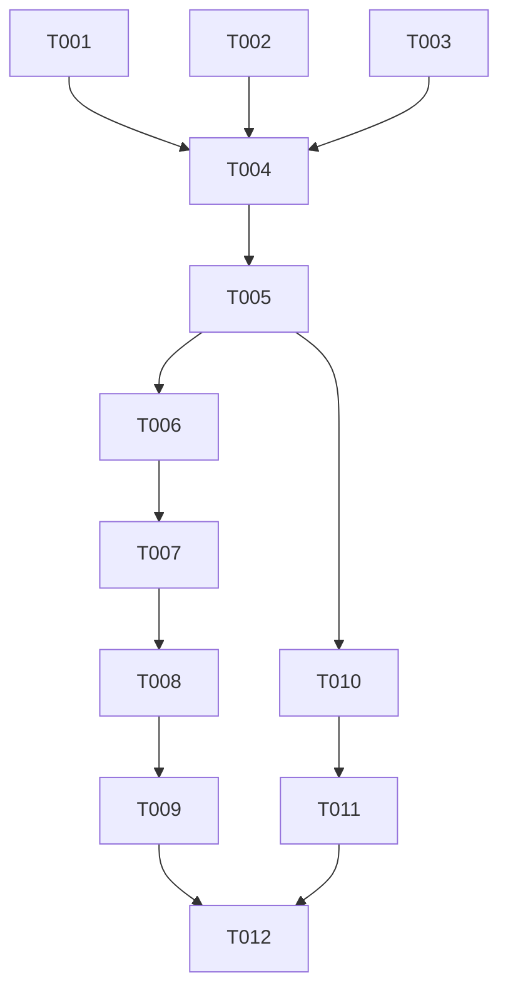

# Tasks: Module Architecture Refactor

**Feature**: `004-refactor-featurebundle-modulebundle`
**Status**: Pending

## Phase 1: Core Definitions (Foundational)

**Goal**: Establish the `IModuleBundle` and related interfaces in the core package to support the new architecture.
**Prerequisite**: None.

- [x] T001 [P] Update `IContext` and `ModuleInit` references in `modules/core/ts/types/src/index.ts`
- [x] T002 [P] Implement `IWidget` interface in `modules/core/ts/types/src/index.ts`
- [x] T003 [P] Implement `IHandler` interface in `modules/core/ts/types/src/index.ts`
- [x] T004 Define `IModuleBundle` interface (replacing `IFeatureBundle`) in `modules/core/ts/types/src/index.ts`
- [~] T005 [P] Verify core types build with `moon run core-types:build` (Skipped - CI flaky, verify via consumer)

## Phase 2: Migrate Definition (User Story 1)

**Goal**: Migrate the `demo/svelte` module to use the new `IModuleBundle` structure.
**Story**: [US1] Developer Defines a Module Journey

- [x] T006 [US1] Rename `IFeatureBundle` to `IModuleBundle` in `modules/demo/svelte/src/index.ts`
- [x] T007 [US1] Implement `widgets` export in `init()` function of `modules/demo/svelte/src/index.ts`
- [x] T008 [US1] Remove implicit side-effect registration in `modules/demo/svelte/src/index.ts` (if applicable)
- [x] T009 [US1] Verify module compiles with `moon run svelte-demo:build`

## Phase 3: Shell Integration & Verification (User Story 2)

**Goal**: Ensure the App Shell can consume the new bundle format.
**Story**: [US2] User Navigates via Handler

- [x] T010 [US2] Update App Shell registry to consume `IModuleBundle` instead of `IFeatureBundle` (location: `modules/core/ts/registry`)
- [x] T011 [US2] Update App Shell dynamic loader to handle `widgets` and `handlers` in `apps/sv-appshell/src/routes/[...rest]/+page.svelte`
- [ ] T012 [US2] Verify end-to-end flow by running `moon run sv-appshell:dev` and checking demo page

## Dependencies

